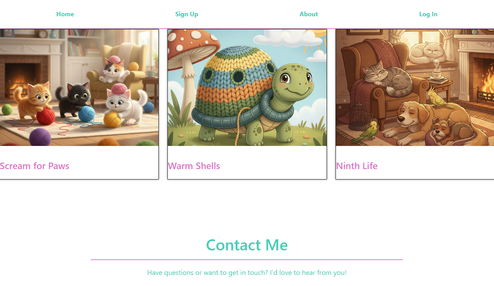
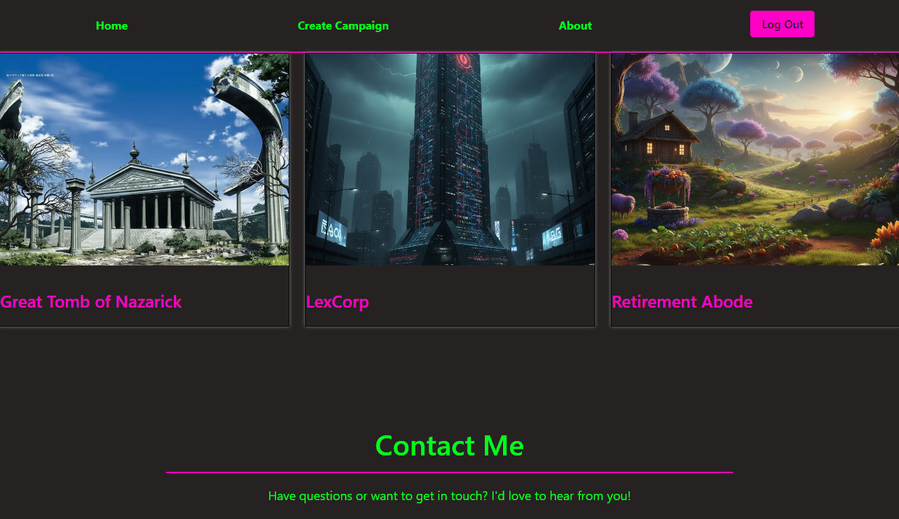
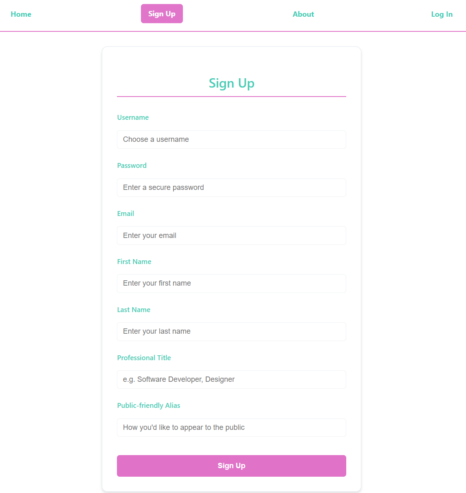
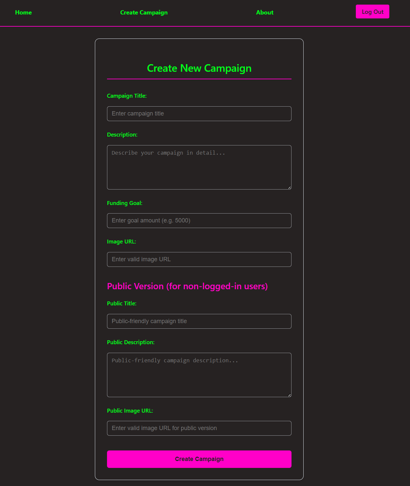
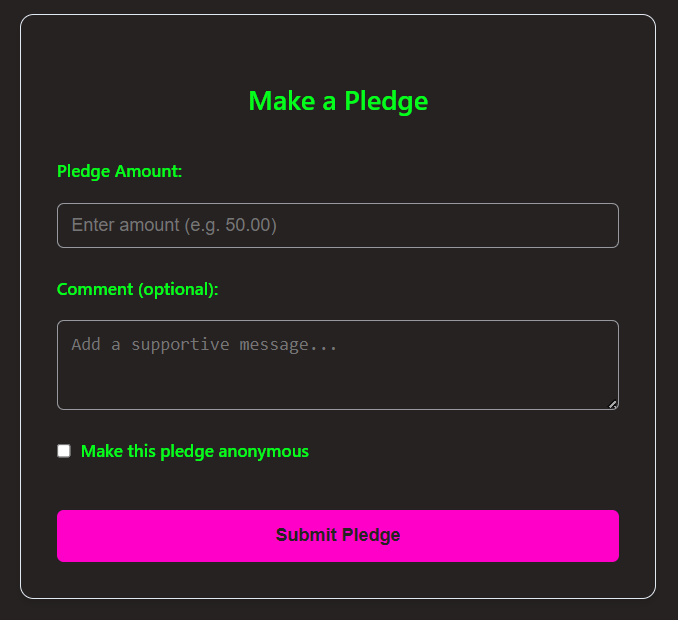
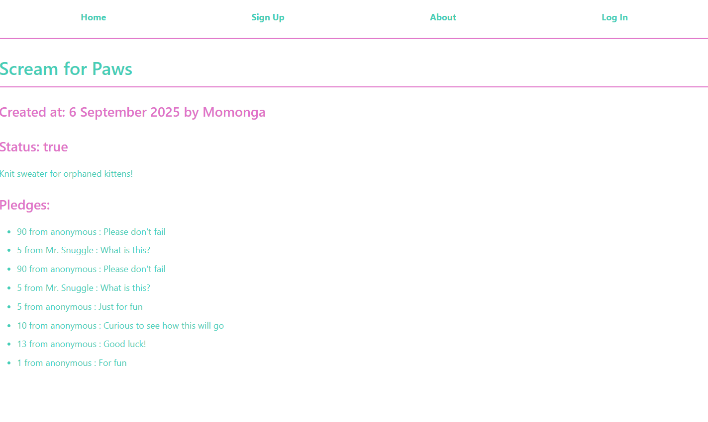
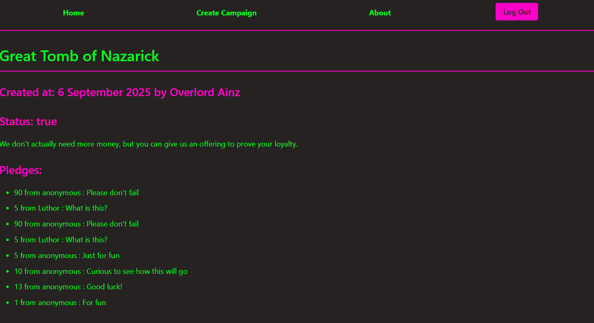
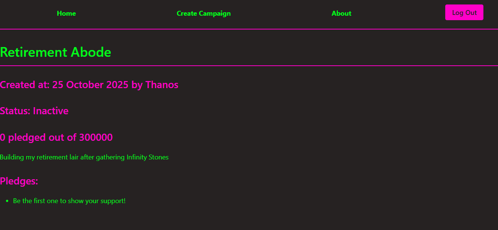

# Crowdfunding Front End
Sheila S.

## Planning:
### Concept/Name
Crowdfunding for villain lair masquerading as knitting project for charity.

### Front End (Netlify) URL
https://yarnarchy.netlify.app/

### Intended Audience/User Stories
- Evil henchman who would like to fund a new/established villain lair, or who'd like to simply support their favourite villain.
- Villains with aspirations to be a supervillain. After all, you can't be considered a supervillain if don't have your own deadly lair.  

### Front End Pages/Functionality

To follow the theme of villains masking their activity, the site implemented a function to change the displayed CSS styling based on whether the user is logged in.
Where this applied, a screenshot for each version will be included.

- Home page
    - All campaigns
        - Homepage will change colour theme when user is logged in
        - Displayed campaigns on the page will change its image and name when user is logged in
    - Non-functional contact form
- Navigation Bar
    - Links to different pages
    - Link to Log In page, which changes to Log Out functionality when user is logged in
    - Link to Sign Up page, which changes to Create Campaign when user is logged in
    - Link to About page
- Create new campaigns
    - Form containing campaign details
    - Ability to submit
- Campaign Page
    - Display campaign details
        - Displayed campaign title will change based on user login status
        - Displayed campaign owner name will change based on user login status
        - Displayed campaign description will change based on user login status
    - Display total amount pledged out of target total
    - Display comments from pledges with names/anonymous
        - Displayed name will swicth based on user login status - if user is logged in, nickname will be displayed, otherwise an alternative nickname is displayed instead
        - Displayed name will always be 'anonymous' if the donor chose to be anonymous, regardless of whether user is logged in
    - Display a default message if there is no pledge
    - Ability to add pledge for an active/open campaign, for logged in user
        - Form containing pledge details (amount, comment, anonymity)
    - User is able to pledge multiple times for the same campaign
- Logon
    - Form for username and password
    - Error message for validation
- Signup
    - Ability to create new user
    - Ability to edit username/email/password is not supported
- About
    - Content changes based on whether user is logged in

#### Homepage
This is the homepage shown when user is not logged in.

This is the homepage shown when user is logged in.

#### Creating a new user

* username
* email
* password
* first name
* last name
* professional title
* public-friendly alias

All fields are mandatory.

#### Creating a new campaign
To create a new campaign, you must be logged in.
* title
* description
* goal
* image (URL)
* public title (eg., the title that will be displayed to users who are not logged in)
* public description (eg., the description that will be displayed to users who are not logged in)
* public image (URL) (eg., the image that will be displayed to users who are not logged in)

All fields are mandatory.

#### Creating a new pledge
New pledge form is shown only when the user is logged in, and only for active campaigns. This form is displayed at the bottom of the selected Campaign Page.
* amount
* comment
* anonymity

Screenshot below only shows the Pledge Form itself.

#### Campaign Page
Campaign page will change based on whether the user is logged in.
The fields that are affected:
* Campaign title
* Campaign Owner name
* Campaign description
* Displayed name of donor

Campaign page for Campaign #1 when user is not logged in.

Campaign page for Campaign #1 when user is logged in.

Campaign page for Campaign #3 when user is logged in but there is no pledge and Casmpaign is inactive.

### Additional Notes
Ideas, extra concepts, etc. that were considered during the development phase.
- Pledge cannot be cancelled or altered - what kind of villain returns what they took? 
- Button on the Campaign Page to activate/deactivate the campaign - but why would a villain want to deactivate a campaign that gives them money?
- Contact form was added but not functional, because no villain ever listens to feedback.